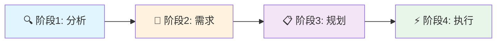

# Claude Code Meta-Agent 集合

🚀 **为任何使用 Claude Code 的项目创建和管理定制化的 subagent 集合**

[](https://opensource.org/licenses/MIT)
[](https://claude.ai/code)
[](./claude/agents)
[]()

[English](README.md) | **中文**

## 🎯 概述

本仓库提供了一套强大的 Meta-Agent 集合，帮助您在使用 Claude Code 时为项目创建、更新和管理定制化的 subagent 集合。无论您是开始一个新项目还是优化现有项目，这些 Meta-Agent 都能分析您的代码库并生成针对您特定需求量身定制的专门化 AI Agent。

### 什么是 Meta-Agent？

Meta-Agent 是本仓库中的核心开源 Agent（根目录下以 `meta-agent` 开头的文件）。它们是专门用于为您的特定项目创建定制化 subagent 集合的工具。`.claude/agents/` 目录中的 Agent 是 Meta-Agent 为本仓库自身生成的**示例输出**，展示了 Meta-Agent 能为您的项目创建什么样的 Agent。

### 为什么使用 Meta-Agent？

- **🎨 定制化解决方案**：生成专门为您项目的技术栈和架构设计的 Agent
- **🔄 持续演进**：随着项目的发展更新和优化您的 Agent 集合
- **🌐 双语支持**：所有 Agent 完全支持中英文版本
- **⚡ 模型优化**：自动为每个任务分配最具成本效益的 Claude 模型（Haiku/Sonnet/Opus）
- **📊 质量保证**：内置验证和分析工具确保高质量的 Agent 生成

## 🚀 快速开始

```bash
# 在 Claude Code 中，使用 Meta-Agent 为您的项目创建 Agent
@meta-agent 为我的 React 项目创建定制化 Agent

# 或者随着项目演进更新现有 Agent
@meta-agent-updater 更新我现有的 Agent 集合

# 综合管理（创建和更新）
@meta-agent-unified 管理我的项目 Agent
```

## 📦 可用的 Meta-Agent

### 核心 Meta-Agent（开源）

这些是本仓库提供的用于为您的项目创建 subagent 集合的主要 Meta-Agent：

| Agent | 用途 | 最适合 | 模型 |
|-------|---------|----------|-------|
| **meta-agent** | 创建新的定制化 Agent 集合 | 没有现有 Agent 的新项目 | sonnet |
| **meta-agent-zh** | Meta-Agent 的中文版 | 中文团队 | sonnet |
| **meta-agent-updater** | 更新和优化现有 Agent | 有过时 Agent 的项目 | sonnet |
| **meta-agent-updater-zh** | 更新器的中文版 | 中文团队 | sonnet |
| **meta-agent-unified** | 结合创建和更新功能 | 完整的 Agent 生命周期管理 | sonnet |
| **meta-agent-unified-zh** | 统一 Agent 的中文版 | 中文团队 | sonnet |

### 示例生成的 Agent（在 `.claude/agents/` 目录中）

这些 Agent 是 Meta-Agent 为本仓库自身生成的，作为 Meta-Agent 能为您的项目创建什么样的 Agent 的示例：

| 类别 | Agent | 用途 |
|----------|--------|---------|
| **开发** | agent-template-generator, agent-validator | 创建和验证新的 Agent 模板 |
| **本地化** | bilingual-synchronizer | 保持中英文版本同步 |
| **优化** | model-assignment-optimizer, prompt-quality-analyzer | 优化性能和质量 |
| **文档** | claude-md-updater, readme-generator, agent-catalog-manager | 维护文档 |
| **分析** | workflow-validator, pattern-extractor, feature-gap-analyzer | 分析和改进 Agent |
| **工具** | git-hook-manager, quick-agent-selector | 开发工具和实用程序 |

> 📌 **注意**：`.claude/agents/` 中的 Agent 是针对本 Meta-Agent 仓库的。当您在自己的项目上使用 Meta-Agent 时，它们将生成适合您项目需求的不同 Agent。

## 💡 工作原理

### 交互式工作流程

所有 Meta-Agent 都遵循结构化的四阶段交互式工作流程：



1. **阶段1：自动分析** - 扫描您的代码库以理解结构和技术
2. **阶段2：交互式需求收集** - 收集您的特定需求和偏好
3. **阶段3：规划与审批** - 呈现定制计划供您确认
4. **阶段4：执行** - 生成批准的 Agent 集合

## 📖 使用示例

### 示例1：新的 Next.js 项目

```bash
@meta-agent 为我的 Next.js 电商项目创建 Agent
```

Meta-Agent 将：
- 分析您的 Next.js 项目结构
- 识别 React 组件、API 路由和数据库模型
- 询问您的特定需求（测试、文档、部署等）
- 生成专门的 Next.js 开发 Agent

### 示例2：更新 Python 项目 Agent

```bash
@meta-agent-updater 我的 Python 项目现在使用 FastAPI 而不是 Flask
```

更新器将：
- 审查您现有的 Agent
- 识别过时的 Flask 特定 Agent
- 用 FastAPI 优化版本更新它们
- 为 FastAPI 特定功能添加新 Agent

### 示例3：双语团队支持

```bash
@bilingual-synchronizer 将所有 Agent 同步到中文
```

创建所有 Agent 的中文版本，同时保持语义等价。

## 🛠️ 安装与设置

### 前置要求

- Claude Code (claude.ai/code)
- 项目的 Git 仓库
- 对 Claude Code Agent 的基本了解

### 开始使用

1. **克隆此仓库**（可选 - Agent 可直接在 Claude Code 中使用）：
   ```bash
   git clone https://github.com/liqiongyu/meta_agent_for_claude_code.git
   ```

2. **在 Claude Code 中调用 Meta-Agent**：
   ```bash
   @meta-agent 为我的项目创建 Agent
   ```

3. **遵循交互式工作流程**：
   - 让 Agent 分析您的项目
   - 在提示时提供您的需求
   - 审查并批准计划
   - Agent 将在 `.claude/agents/` 中创建

## 📂 项目结构

```
meta_agent_for_claude_code/
├── meta-agent.md                 # 创建新 Agent 的原始 Meta-Agent
├── meta-agent-zh.md              # 中文版
├── meta-agent-updater.md         # 更新现有集合的 Agent
├── meta-agent-updater-zh.md      # 中文版
├── meta-agent-unified.md         # 结合创建和更新的 Agent
├── meta-agent-unified-zh.md      # 中文版
├── .claude/
│   └── agents/                   # Meta-Agent 为本仓库生成的示例 Agent
│       ├── agent-template-generator.md
│       ├── agent-validator.md
│       ├── bilingual-synchronizer.md
│       └── ... (另外11个专门 Agent)
├── CLAUDE.md                     # Claude Code 的项目说明
├── LICENSE                       # MIT 许可证
├── README.md                     # 英文文档
└── README-zh.md                  # 本文件
```

## 🔧 配置

### 模型分配策略

Agent 自动分配到最优的 Claude 模型：

- **Haiku** 🏃‍♂️：快速、轻量级任务（验证、简单查询）
- **Sonnet** 🎭：平衡性能（代码生成、分析）
- **Opus** 🎼：复杂推理（架构设计、优化）

### 存储约定

- **默认**：项目目录中的 `.claude/agents/`
- **全局**：`~/.claude/agents/[project-name]/` 用于共享 Agent
- **已弃用**：`.claude/agents/deprecated/` 用于旧版本

## 🤝 贡献

我们欢迎贡献！请查看 [CONTRIBUTING.md](CONTRIBUTING.md) 了解指南。

### 如何贡献

1. Fork 仓库
2. 创建功能分支（`git checkout -b feature/amazing-agent`）
3. 提交您的更改（`git commit -m 'Add amazing agent'`）
4. 推送到分支（`git push origin feature/amazing-agent`）
5. 开启 Pull Request

### 开发指南

- 遵循现有的 YAML frontmatter 格式
- 为 Meta-Agent 实现四阶段交互式工作流程
- 在适用时包含中英文版本
- 添加全面的文档

## 📝 更新日志

查看 [CHANGELOG.md](CHANGELOG.md) 了解详细的更改历史。

## 🙏 致谢

- Anthropic 的 Claude Code 团队提供的出色平台
- 开源社区的反馈和贡献
- 帮助塑造这些 Meta-Agent 的早期采用者

## 📄 许可证

本项目采用 MIT 许可证 - 查看 [LICENSE](LICENSE) 文件了解详情。

## 🐛 问题与支持

- **错误报告**：[GitHub Issues](https://github.com/liqiongyu/meta_agent_for_claude_code/issues)
- **功能请求**：[GitHub Discussions](https://github.com/liqiongyu/meta_agent_for_claude_code/discussions)
- **文档**：[Wiki](https://github.com/liqiongyu/meta_agent_for_claude_code/wiki)

## 🌟 Star 历史

如果您觉得这个项目有用，请考虑给它一个 star ⭐️

---

<p align="center">
  用 ❤️ 为 Claude Code 社区制作
</p>

<p align="center">
  <a href="#claude-code-meta-agent-集合">返回顶部 ↑</a>
</p>