```mermaid
graph LR
    A[🔠阶段1: 分æ] --> B[💬 阶段2: 需求]
    B --> C[📋 阶段3: 规划]
    C --> D[⚡ 阶段4: 执行]
    
    style A fill:#e1f5fe
    style B fill:#fff3e0
    style C fill:#f3e5f5
    style D fill:#e8f5e9
```

# Claude Code 元代理集合

🚀 **为任何使用 Claude Code 的项目创建和管理定制化的子代理集合**

[](https://opensource.org/licenses/MIT)
[](https://claude.ai/code)
[](./claude/agents)
[]()

[English](README.md) | **中文**

## 🎯 概述

本仓库提供了一套强大的元代理（meta-agents）集合，帮助您在使用 Claude Code 时为项目创建、更新和管理定制化的子代理集合。无论您是开始一个新项目还是优化现有项目，这些元代理都能分析您的代码库并生成针对您特定需求量身定制的专门化 AI 代理。

### 为什么使用元代理？

- **🎨 定制化解决方案**：生成专门为您项目的技术栈和架构设计的代理
- **🔄 持续演进**：随着项目的发展更新和优化您的代理集合
- **🌐 双语支持**：所有代理完全支持中英文版本
- **⚡ 模型优化**：自动为每个任务分配最具成本效益的 Claude 模型（Haiku/Sonnet/Opus）
- **📊 质量保证**：内置验证和分析工具确保高质量的代理生成

## 🚀 快速开始

```bash
# 在 Claude Code 中，使用元代理为您的项目创建代理
@meta-agent 为我的 React 项目创建定制化代理

# 或者随着项目演进更新现有代理
@meta-agent-updater 更新我现有的代理集合

# 综合管理（创建和更新）
@meta-agent-unified 管理我的项目代理
```

## 📦 可用的元代理

### 核心元代理

| 代理 | 用途 | 最适合 | 模型 |
|-------|---------|----------|-------|
| **meta-agent** | 创建新的定制化代理集合 | 没有现有代理的新项目 | sonnet |
| **meta-agent-zh** | 元代理的中文版 | 中文团队 | sonnet |
| **meta-agent-updater** | 更新和优化现有代理 | 有过时代理的项目 | sonnet |
| **meta-agent-updater-zh** | 更新器的中文版 | 中文团队 | sonnet |
| **meta-agent-unified** | 结合创建和更新功能 | 完整的代理生命周期管理 | sonnet |
| **meta-agent-unified-zh** | 统一代理的中文版 | 中文团队 | sonnet |

### 支持代理（在 `.claude/agents/` 目录中）

| 类别 | 代理 | 用途 |
|----------|--------|---------|
| **开发** | agent-template-generator, agent-validator | 创建和验证新的代理模板 |
| **本地化** | bilingual-synchronizer | 保持中英文版本同步 |
| **优化** | model-assignment-optimizer, prompt-quality-analyzer | 优化性能和质量 |
| **文档** | claude-md-updater, readme-generator, agent-catalog-manager | 维护文档 |
| **分析** | workflow-validator, pattern-extractor, feature-gap-analyzer | 分析和改进代理 |
| **工具** | git-hook-manager, quick-agent-selector | 开发工具和实用程序 |

## 💡 工作原理

### 交互式工作流程

所有元代理都遵循结构化的四阶段交互式工作流程：



1. **阶段1：自动分析** - 扫描您的代码库以理解结构和技术
2. **阶段2：交互式需求收集** - 收集您的特定需求和偏好
3. **阶段3：规划与审批** - 呈现定制计划供您确认
4. **阶段4：执行** - 生成批准的代理集合

## 📖 使用示例

### 示例1：新的 Next.js 项目

```bash
@meta-agent 为我的 Next.js 电商项目创建代理
```

元代理将：
- 分析您的 Next.js 项目结构
- 识别 React 组件、API 路由和数据库模型
- 询问您的特定需求（测试、文档、部署等）
- 生成专门的 Next.js 开发代理

### 示例2：更新 Python 项目代理

```bash
@meta-agent-updater 我的 Python 项目现在使用 FastAPI 而不是 Flask
```

更新器将：
- 审查您现有的代理
- 识别过时的 Flask 特定代理
- 用 FastAPI 优化版本更新它们
- 为 FastAPI 特定功能添加新代理

### 示例3：双语团队支持

```bash
@bilingual-synchronizer 将所有代理同步到中文
```

创建所有代理的中文版本，同时保持语义等价。

## 🛠️ 安装与设置

### 前置要求

- Claude Code (claude.ai/code)
- 项目的 Git 仓库
- 对 Claude Code 代理的基本了解

### 开始使用

1. **克隆此仓库**（可选 - 代理可直接在 Claude Code 中使用）：
   ```bash
   git clone https://github.com/liqiongyu/meta_agent_for_claude_code.git
   ```

2. **在 Claude Code 中调用元代理**：
   ```bash
   @meta-agent 为我的项目创建代理
   ```

3. **遵循交互式工作流程**：
   - 让代理分析您的项目
   - 在提示时提供您的需求
   - 审查并批准计划
   - 代理将在 `.claude/agents/` 中创建

## 📂 项目结构

```
meta_agent_for_claude_code/
├── meta-agent.md                 # 创建新代理的原始元代理
├── meta-agent-zh.md              # 中文版
├── meta-agent-updater.md         # 更新现有集合的代理
├── meta-agent-updater-zh.md      # 中文版
├── meta-agent-unified.md         # 结合创建和更新的代理
├── meta-agent-unified-zh.md      # 中文版
├── .claude/
│   └── agents/                   # 生成的支持代理
│       ├── agent-template-generator.md
│       ├── agent-validator.md
│       ├── bilingual-synchronizer.md
│       └── ... (另外11个专门代理)
├── CLAUDE.md                     # Claude Code 的项目说明
├── LICENSE                       # MIT 许可证
├── README.md                     # 英文文档
└── README-zh.md                  # 本文件
```

## 🔧 配置

### 模型分配策略

代理自动分配到最优的 Claude 模型：

- **Haiku** 🏃‍♂️：快速、轻量级任务（验证、简单查询）
- **Sonnet** 🎭：平衡性能（代码生成、分析）
- **Opus** 🎼：复杂推理（架构设计、优化）

### 存储约定

- **默认**：项目目录中的 `.claude/agents/`
- **全局**：`~/.claude/agents/[project-name]/` 用于共享代理
- **已弃用**：`.claude/agents/deprecated/` 用于旧版本

## 🤝 贡献

我们欢迎贡献！请查看 [CONTRIBUTING.md](CONTRIBUTING.md) 了解指南。

### 如何贡献

1. Fork 仓库
2. 创建功能分支（`git checkout -b feature/amazing-agent`）
3. 提交您的更改（`git commit -m 'Add amazing agent'`）
4. 推送到分支（`git push origin feature/amazing-agent`）
5. 开启 Pull Request

### 开发指南

- 遵循现有的 YAML frontmatter 格式
- 为元代理实现四阶段交互式工作流程
- 在适用时包含中英文版本
- 添加全面的文档

## 📝 更新日志

查看 [CHANGELOG.md](CHANGELOG.md) 了解详细的更改历史。

## 🙏 致谢

- Anthropic 的 Claude Code 团队提供的出色平台
- 开源社区的反馈和贡献
- 帮助塑造这些元代理的早期采用者

## 📄 许可证

本项目采用 MIT 许可证 - 查看 [LICENSE](LICENSE) 文件了解详情。

## 🐛 问题与支持

- **错误报告**：[GitHub Issues](https://github.com/liqiongyu/meta_agent_for_claude_code/issues)
- **功能请求**：[GitHub Discussions](https://github.com/liqiongyu/meta_agent_for_claude_code/discussions)
- **文档**：[Wiki](https://github.com/liqiongyu/meta_agent_for_claude_code/wiki)

## 🌟 Star 历史

如果您觉得这个项目有用，请考虑给它一个 star ⭐️

---

<p align="center">
  用 ❤️ 为 Claude Code 社区制作
</p>

<p align="center">
  <a href="#claude-code-元代理集合">返回顶部 ↑</a>
</p>