# Meta-Agent for Claude Code

🚀 **Create and manage customized subagent collections for any project using Claude Code**

[](https://opensource.org/licenses/MIT)
[](https://claude.ai/code)
[](./claude/agents)
[]()

**English** | [中文](README-zh.md)

## 🎯 Overview

This repository provides a powerful collection of Meta-Agents that help you create, update, and manage customized subagent collections for your projects when using Claude Code. Whether you're starting a new project or optimizing an existing one, these Meta-Agents analyze your codebase and generate specialized AI agents tailored to your specific needs.

### What Are Meta-Agents?

Meta-Agents are the core open-source agents in this repository (files starting with `meta-agent` in the root directory). They are specialized tools that create customized subagent collections for your specific projects. The agents in `.claude/agents/` directory are **example outputs** generated by Meta-Agents for this repository itself, demonstrating what Meta-Agents can create for your projects.

### Why Use Meta-Agents?

- **🎨 Customized Solutions**: Generate agents specifically designed for your project's technology stack and architecture
- **🔄 Continuous Evolution**: Update and optimize your agent collection as your project grows
- **🌐 Bilingual Support**: Full support for English and Chinese versions of all agents
- **⚡ Model Optimization**: Automatically assigns the most cost-effective Claude model (Haiku/Sonnet/Opus) for each task
- **📊 Quality Assurance**: Built-in validation and analysis tools ensure high-quality agent generation

## 🚀 Quick Start

```bash
# In Claude Code, use the meta-agent to create agents for your project
@meta-agent Create customized agents for my React project

# Or update existing agents as your project evolves
@meta-agent-updater Update my existing agent collection

# For comprehensive management (both create and update)
@meta-agent-unified Manage my project agents
```

## 📦 Available Meta-Agents

### Core Meta-Agents (Open Source)

These are the main Meta-Agents provided by this repository for creating subagent collections for your projects:

| Agent | Purpose | Best For | Model |
|-------|---------|----------|-------|
| **meta-agent** | Creates new customized agent collections | New projects without existing agents | sonnet |
| **meta-agent-zh** | Chinese version of Meta-Agent | Chinese-speaking teams | sonnet |
| **meta-agent-updater** | Updates and optimizes existing agents | Projects with outdated agents | sonnet |
| **meta-agent-updater-zh** | Chinese version of updater | Chinese-speaking teams | sonnet |
| **meta-agent-unified** | Combined creation and update capabilities | Complete agent lifecycle management | sonnet |
| **meta-agent-unified-zh** | Chinese version of unified agent | Chinese-speaking teams | sonnet |

### Example Generated Agents (in `.claude/agents/`)

These agents were generated by Meta-Agents for this repository itself, serving as examples of what Meta-Agents can create for your projects:

| Category | Agents | Purpose |
|----------|--------|---------|
| **Development** | agent-template-generator, agent-validator | Create and validate new agent templates |
| **Localization** | bilingual-synchronizer | Keep English and Chinese versions in sync |
| **Optimization** | model-assignment-optimizer, prompt-quality-analyzer | Optimize performance and quality |
| **Documentation** | claude-md-updater, readme-generator, agent-catalog-manager | Maintain documentation |
| **Analysis** | workflow-validator, pattern-extractor, feature-gap-analyzer | Analyze and improve agents |
| **Tools** | git-hook-manager, quick-agent-selector | Development tools and utilities |

> 📌 **Note**: The agents in `.claude/agents/` are specific to this Meta-Agent repository. When you use Meta-Agents on your own projects, they will generate different agents tailored to your project's needs.

## 💡 How It Works

### Interactive Workflow

All Meta-Agents follow a structured 4-phase interactive workflow:

```mermaid
graph LR
    A[🔍 Phase 1: Analysis] --> B[💬 Phase 2: Requirements]
    B --> C[📋 Phase 3: Planning]
    C --> D[⚡ Phase 4: Execution]
    
    style A fill:#e1f5fe
    style B fill:#fff3e0
    style C fill:#f3e5f5
    style D fill:#e8f5e9
```



1. **Phase 1: Automatic Analysis** - Scans your codebase to understand structure and technologies
2. **Phase 2: Interactive Requirements** - Gathers your specific needs and preferences
3. **Phase 3: Planning & Approval** - Presents a customized plan for your confirmation
4. **Phase 4: Execution** - Generates the approved agent collection

## 📖 Usage Examples

### Example 1: New Next.js Project

```bash
@meta-agent Create agents for my Next.js e-commerce project
```

The Meta-Agent will:
- Analyze your Next.js project structure
- Identify React components, API routes, and database models
- Ask about your specific needs (testing, documentation, deployment, etc.)
- Generate specialized agents for Next.js development

### Example 2: Updating Python Project Agents

```bash
@meta-agent-updater My Python project now uses FastAPI instead of Flask
```

The updater will:
- Review your existing agents
- Identify outdated Flask-specific agents
- Update them with FastAPI-optimized versions
- Add new agents for FastAPI-specific features

### Example 3: Bilingual Team Support

```bash
@bilingual-synchronizer Sync all my agents to Chinese
```

Creates Chinese versions of all your agents while maintaining semantic equivalence.

## 🛠️ Installation & Setup

### Prerequisites

- Claude Code (claude.ai/code)
- Git repository for your project
- Basic understanding of Claude Code agents

### Getting Started

1. **Clone this repository** (optional - agents work directly in Claude Code):
   ```bash
   git clone https://github.com/liqiongyu/meta_agent_for_claude_code.git
   ```

2. **In Claude Code, invoke the meta-agent**:
   ```bash
   @meta-agent Create agents for my project
   ```

3. **Follow the interactive workflow**:
   - Let the agent analyze your project
   - Provide your requirements when prompted
   - Review and approve the plan
   - Agents will be created in `.claude/agents/`

## 📂 Project Structure

```
meta_agent_for_claude_code/
├── meta-agent.md                 # Original Meta-Agent for creating new agents
├── meta-agent-zh.md              # Chinese version
├── meta-agent-updater.md         # Agent for updating existing collections
├── meta-agent-updater-zh.md      # Chinese version
├── meta-agent-unified.md         # Combined creation and update agent
├── meta-agent-unified-zh.md      # Chinese version
├── .claude/
│   └── agents/                   # Example agents generated by Meta-Agents for this repository
│       ├── agent-template-generator.md
│       ├── agent-validator.md
│       ├── bilingual-synchronizer.md
│       └── ... (11 more specialized agents)
├── CLAUDE.md                     # Project instructions for Claude Code
├── LICENSE                       # MIT License
└── README.md                     # This file
```

## 🔧 Configuration

### Model Assignment Strategy

Agents are automatically assigned to the optimal Claude model:

- **Haiku** 🏃‍♂️: Fast, lightweight tasks (validation, simple queries)
- **Sonnet** 🎭: Balanced performance (code generation, analysis)
- **Opus** 🎼: Complex reasoning (architecture design, optimization)

### Storage Conventions

- **Default**: `.claude/agents/` in your project directory
- **Global**: `~/.claude/agents/[project-name]/` for shared agents
- **Deprecated**: `.claude/agents/deprecated/` for old versions

## 🤝 Contributing

We welcome contributions! Please see [CONTRIBUTING.md](CONTRIBUTING.md) for guidelines.

### How to Contribute

1. Fork the repository
2. Create a feature branch (`git checkout -b feature/amazing-agent`)
3. Commit your changes (`git commit -m 'Add amazing agent'`)
4. Push to the branch (`git push origin feature/amazing-agent`)
5. Open a Pull Request

### Development Guidelines

- Follow the existing YAML frontmatter format
- Implement the 4-phase interactive workflow for Meta-Agents
- Include both English and Chinese versions when applicable
- Add comprehensive documentation

## 📝 Changelog

See [CHANGELOG.md](CHANGELOG.md) for a detailed history of changes.

## 🙏 Acknowledgments

- Claude Code team at Anthropic for the amazing platform
- Open source community for feedback and contributions
- Early adopters who helped shape these Meta-Agents

## 📄 License

This project is licensed under the MIT License - see the [LICENSE](LICENSE) file for details.

## 🐛 Issues & Support

- **Bug Reports**: [GitHub Issues](https://github.com/liqiongyu/meta_agent_for_claude_code/issues)
- **Feature Requests**: [GitHub Discussions](https://github.com/liqiongyu/meta_agent_for_claude_code/discussions)
- **Documentation**: [Wiki](https://github.com/liqiongyu/meta_agent_for_claude_code/wiki)

## 🌟 Star History

If you find this project useful, please consider giving it a star ⭐️

---

<p align="center">
  Made with ❤️ for the Claude Code community
</p>

<p align="center">
  <a href="#meta-agent-collection-for-claude-code">Back to top ↑</a>
</p>